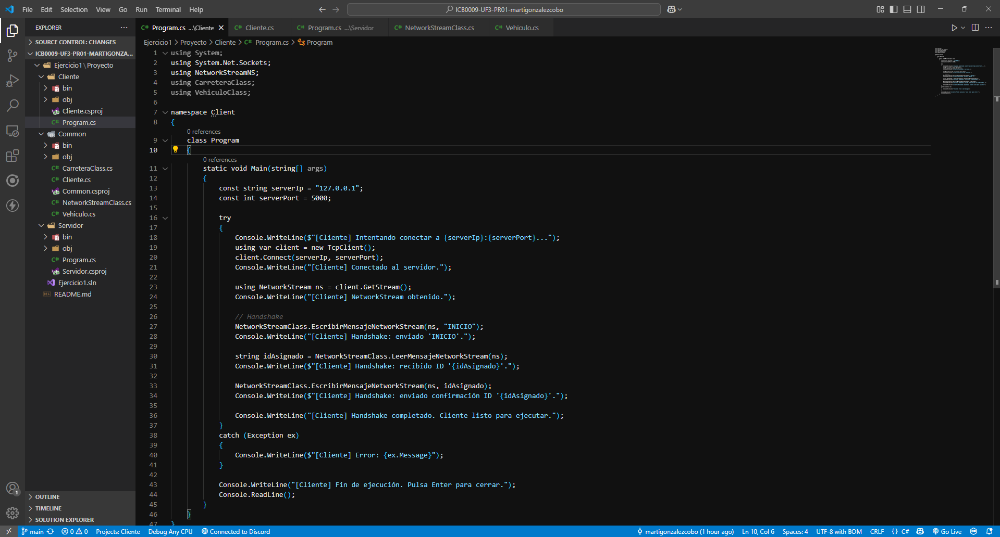

# Ejercicio 1

El cliente TCP se conecta a un servidor local (`127.0.0.1`) en el puerto `5000`, realiza un **handshake** inicial y sigue comunicándose con el servidor por si hay cambios.

---

## Captura Cliente



---

## Funcionamiento

- Se conecta al servidor.
- Envía el mensaje `"INICIO"`.
- Recibe un **ID asignado**.
- Reenvía el **ID** para confirmar el handshake.
- Maneja errores de conexión o transmisión.
- Espera la tecla `Enter` para cerrar el programa.

---

## Diagrama de comunicación

```plaintext
[Cliente] ---(INICIO)---> [Servidor]
[Cliente] <---(ID ASIGNADO)--- [Servidor]
[Cliente] ---(ID ASIGNADO)---> [Servidor]
[Cliente] -> Handshake completado
````

El **servidor TCP** que escucha en el puerto `5000`, acepta conexiones de clientes, y realiza un **handshake** inicial para registrar vehículos. Cada cliente se maneja en su propio **hilo**.

---

## Capturas Servidor


---

## Funcionamiento del Servidor

- Se levanta un **servidor TCP** escuchando en todas las IP (`IPAddress.Any`).
- Cada vez que un cliente se conecta:
  - Se crea un **nuevo hilo** para gestionar esa conexión.
  - Se realiza un **handshake** con el cliente.
  - Se asigna un **ID** único al vehículo.
  - Se guarda en una **lista de clientes conectados**.

---

## Estructura del Código

| Parte | Descripción |
|:-----|:------------|
| `Main` | Inicia el servidor y acepta clientes en un bucle infinito. |
| `HandleClient` | Gestiona cada cliente en un hilo separado. Realiza handshake y maneja conexiones. |

---

## Proceso de Handshake

| Paso | Descripción |
|:----:|:-----------|
| 1 | El cliente envía el mensaje `"INICIO"`. |
| 2 | El servidor responde con un **ID único** generado. |
| 3 | El cliente responde confirmando el **ID** recibido. |
| 4 | El servidor registra al cliente en la lista de conectados. |

---

## Diagrama de Flujo de Comunicación

```plaintext
[Servidor] <-- Cliente se conecta
[Servidor] <-- Recibe "INICIO"
[Servidor] --> Envía "ID"
[Servidor] <-- Recibe confirmación "ID"
[Servidor] --> Añade cliente a la lista
```

Esta clase proporciona métodos de utilidad para facilitar la comunicación entre cliente y servidor a través de `NetworkStream`, incluyendo el envío y la recepción de mensajes de texto, así como la serialización de objetos como `Vehiculo` y `Carretera`.

---

## Capturas NetworkStreamClass


---

## Funcionalidades implementadas

### Lectura de mensajes de texto

Método `LeerMensajeNetworkStream(NetworkStream NS)`:
- Lee todos los datos disponibles en el `NetworkStream`.
- Devuelve el mensaje como una cadena de texto codificada en **Unicode**.

### Escritura de mensajes de texto

Método `EscribirMensajeNetworkStream(NetworkStream NS, string Str)`:
- Codifica una cadena de texto en **Unicode**.
- Envía el mensaje a través del `NetworkStream`.

---

## Estructura del Archivo

| Método | Descripción |
|:------|:------------|
| `LeerMensajeNetworkStream` | Lee un mensaje de texto del `NetworkStream`. |
| `EscribirMensajeNetworkStream` | Escribe un mensaje de texto en el `NetworkStream`. |

---

## Notas Técnicas

- Se utiliza un `MemoryStream` interno para construir el mensaje recibido antes de decodificarlo.
- La codificación elegida para los mensajes de texto es **Unicode** (`UTF-16`).
- Se asume que los datos llegan en un tamaño razonable (hasta 1024 bytes por fragmento leido).
- El método `DataAvailable` permite saber si hay más datos por recibir.

---

La clase `Cliente` representa la información básica de un cliente conectado al servidor, almacenando su ID único y el `NetworkStream` asociado para la comunicación.

---

## Captura Cliente


---

## Propiedades

| Propiedad | Tipo | Descripción |
|:---------|:-----|:------------|
| `Id` | `int` | ID único asignado al cliente. |
| `NetworkStream` | `NetworkStream` | Flujo de red para enviar y recibir datos del cliente. |

---

## Descripción

- La propiedad `Id` es utilizada para identificar de manera única a cada cliente conectado al servidor.
- La propiedad `NetworkStream` mantiene la referencia al flujo de red abierto con el cliente, permitiendo la comunicación directa.
- Ambas propiedades están marcadas como `required`, lo que significa que deben ser inicializadas al crear una instancia del objeto.

---

## Contexto de Uso

Esta clase se utiliza principalmente en el servidor para:
- Gestionar múltiples clientes de forma organizada.
- Realizar operaciones de lectura y escritura en el `NetworkStream` de cada cliente de manera independiente.
- Controlar la conexión y desconexión de los clientes en el servidor.

---

La clase `Vehiculo` representa un vehículo con sus atributos, como velocidad, posición, dirección, estado (acabado o parado), y proporciona métodos para convertir el objeto a bytes, etc.

---

## Captura Vehículo


---

## Propiedades

| Propiedad   | Tipo    | Descripción                                       |
|-------------|---------|---------------------------------------------------|
| `Id`        | `int`   | ID único del vehículo.                 |
| `Pos`       | `int`   | Posición del vehículo en la carretera.            |
| `Velocidad` | `int`   | Velocidad del vehículo (valor aleatorio entre 100 y 500). |
| `Direccion` | `string`| Dirección hacia la que se mueve el vehículo.      |
| `Acabado`   | `bool`  | Indica si el vehículo ha terminado su trayecto.  |
| `Parado`    | `bool`  | Indica si el vehículo está parado.                |

---

## Métodos

### `Vehiculo()`

Constructor que inicializa:
- **Velocidad**: Un valor aleatorio entre 100 y 500.
- **Pos**: Se inicia en 0.
- **Direccion**: Cadena vacía.
- **Acabado**: Se inicia en `false`.
- **Parado**: Se inicia en `false`.

### `VehiculoaBytes()`

Convierte el objeto `Vehiculo` a un array de bytes utilizando **serialización XML**.

- **Retorno**: Un array de bytes que representa el vehículo.

### `BytesAVehiculo(byte[] data)`

Convierte un array de bytes a un objeto `Vehiculo` deserializándolo desde XML.

- **Parámetro**: `data` - Array de bytes que representa un vehículo.
- **Retorno**: Un objeto `Vehiculo` deserializado.

---

## Descripción

La clase `Vehiculo` proporciona:
- **Serialización y deserialización** de objetos `Vehiculo` a través de XML.
- Métodos para convertir un vehículo a un formato de bytes y reconstruirlo desde este formato.

---
