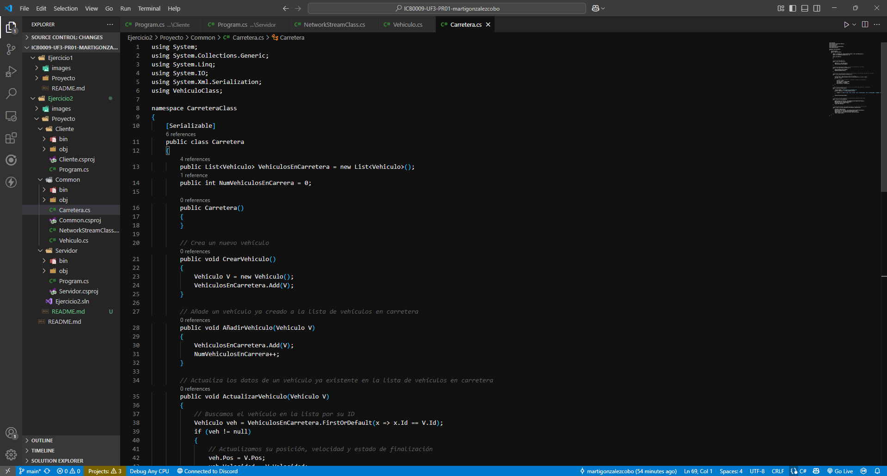
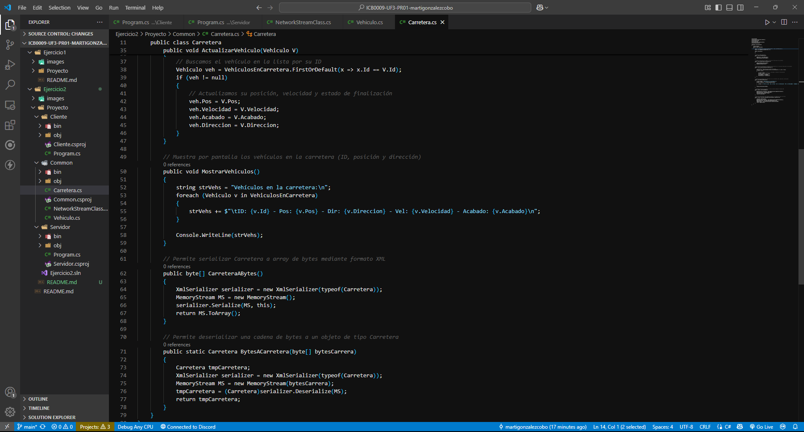
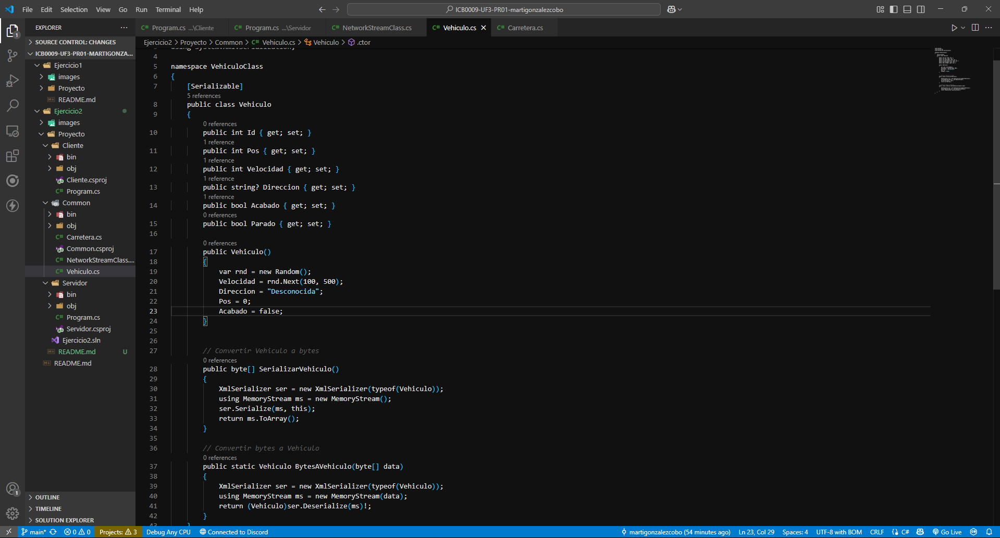
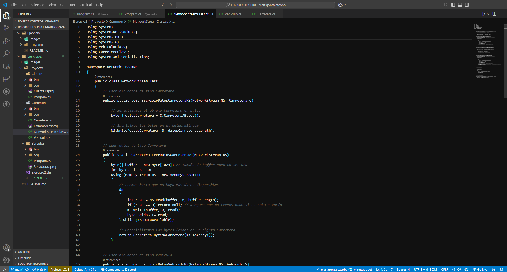
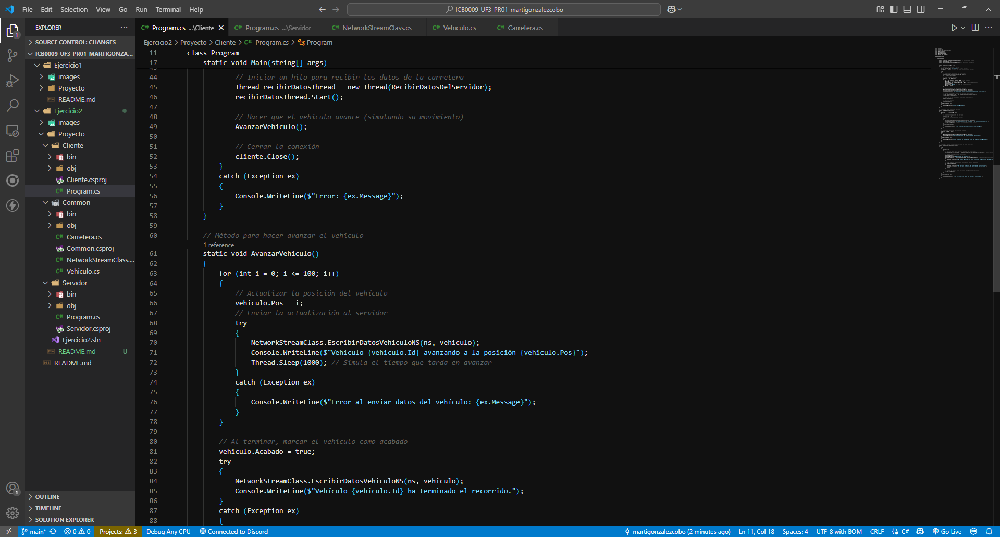
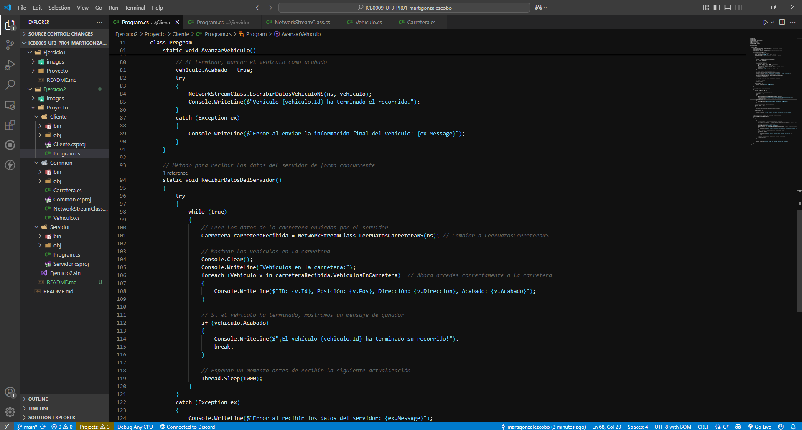

# Ejercicio 2

# Etapa 0: Clases Vehículo y Carretera

## Clase Vehículo

La clase `Vehiculo` tiene la responsabilidad de modelar un vehículo con ciertas propiedades y comportamientos básicos como la posición, velocidad y dirección. Además, permite la serialización y deserialización de un objeto `Vehiculo` a un arreglo de bytes, lo cual facilita su transmisión o almacenamiento.

### Propiedades:
- **Id**: Identificador único del vehículo.
- **Pos**: Posición del vehículo en la carretera.
- **Velocidad**: Velocidad del vehículo.
- **Direccion**: Dirección en la que se mueve el vehículo.
- **Acabado**: Estado que indica si el vehículo ha terminado su recorrido.
- **Parado**: Indica si el vehículo está detenido.

### Métodos:
- **SerializarVehiculo**: Convierte el objeto `Vehiculo` a un arreglo de bytes usando XML.
- **BytesAVehiculo**: Convierte un arreglo de bytes de vuelta a un objeto `Vehiculo`.

---

## Clase Carretera

La clase `Carretera` representa una carretera que contiene una lista de vehículos. Permite gestionar los vehículos que circulan por la carretera, incluyendo la creación, adición y actualización de los mismos.

### Propiedades:
- **VehiculosEnCarretera**: Lista de vehículos que se encuentran en la carretera.
- **NumVehiculosEnCarrera**: Número total de vehículos en la carretera.

### Métodos:
- **CrearVehiculo**: Crea un nuevo vehículo y lo agrega a la lista.
- **AñadirVehiculo**: Añade un vehículo existente a la lista de vehículos en la carretera.
- **ActualizarVehiculo**: Actualiza la información de un vehículo existente en la lista.
- **MostrarVehiculos**: Muestra por consola la información de todos los vehículos en la carretera.
- **CarreteraABytes**: Convierte el objeto `Carretera` a un arreglo de bytes usando XML.
- **BytesACarretera**: Convierte un arreglo de bytes de vuelta a un objeto `Carretera`.

---

## Capturas Carretera




## Captura Vehículo



## Diagrama de Clases

```plaintext
+------------------+        +----------------------+
|     Vehiculo     |        |     Carretera        |
+------------------+        +----------------------+
| - Id: int        |        | - VehiculosEnCarretera|
| - Pos: int       |        | - NumVehiculosEnCarrera|
| - Velocidad: int |        +----------------------+
| - Direccion: string |     | + CrearVehiculo()     |
| - Acabado: bool  |        | + AñadirVehiculo()    |
| - Parado: bool   |        | + ActualizarVehiculo()|
+------------------+        | + MostrarVehiculos()  |
| + SerializarVehiculo() |  | + CarreteraABytes()   |
| + BytesAVehiculo() |      | + BytesACarretera()   |
+------------------+        +----------------------+
```

# Etapa 1: Programación de los Métodos de la Clase NetworkStreamClass

En esta etapa se programan los métodos necesarios para permitir el intercambio de datos de tipo `Vehiculo` y `Carretera` entre el cliente y el servidor. Estos métodos pertenecen a la clase `NetworkStreamClass`, que maneja la lectura y escritura de mensajes a través de un `NetworkStream`.

---

## Métodos Implementados en la Clase `NetworkStreamClass`

### 1. `LeerDatosNetworkStream(NetworkStream NS)`

Este método es responsable de leer los datos de tipo `Vehiculo` y `Carretera` que se reciben a través de un `NetworkStream`. El método procesa los datos recibidos y los convierte en objetos de tipo `Vehiculo` o `Carretera` utilizando la deserialización XML.

**Funcionalidad**:
- Lee los datos desde el `NetworkStream`.
- Deserializa los datos para convertirlos en un objeto de tipo `Vehiculo` o `Carretera`.
- Devuelve el objeto deserializado.



# Ejercicio 2

# Etapa 2: Crear y enviar los datos de un Vehículo

## Descripción

En esta etapa, el cliente es responsable de crear nuevos vehículos que circularán por la carretera. El objetivo principal es que el cliente pueda:
1. Crear un nuevo vehículo con propiedades aleatorias (ID, velocidad)
2. Enviar los datos del vehículo al servidor
3. El servidor debe recibir estos datos, añadir el vehículo a la carretera y mostrar los vehículos existentes

## Implementación Cliente

El cliente realiza las siguientes acciones:
- Establece conexión con el servidor
- Crea un vehículo con propiedades aleatorias
- Envía el vehículo al servidor usando `NetworkStreamClass.EscribirDatosVehiculoNS`
- Inicia un hilo para recibir actualizaciones de la carretera
- Simula el movimiento del vehículo (avanzando posición por posición)


# Ejercicio 2

# Etapa 3: Mover los vehículos

## Descripción

En esta etapa implementamos el movimiento de los vehículos desde su posición inicial (0) hasta el final del recorrido (100). El sistema debe:
1. Simular el avance progresivo de cada vehículo
2. Sincronizar el estado entre cliente y servidor
3. Gestionar la finalización del recorrido




# Ejercicio 2

## Etapa 4: Enviar datos del servidor a todos los clientes

### Implementación en el Servidor

El servidor ahora incluye un mecanismo de difusión a todos los clientes.

# Etapa 5: Recepción de la información del servidor en el cliente

## Implementación de la Recepción Concurrente

### Estructura del Cliente

El cliente ahora maneja dos flujos independientes:
1. **Hilo principal**: Controla el movimiento del vehículo
2. **Hilo secundario**: Escucha actualizaciones del servidor


